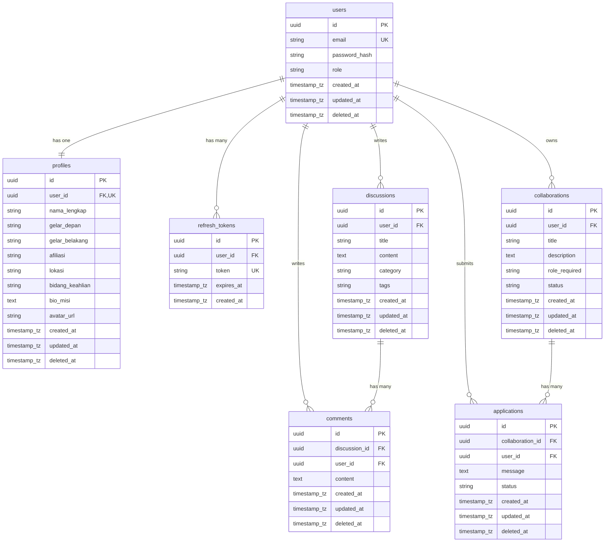

# Database Documentation - Nalakarsa

Dokumen ini mendokumentasikan desain database PostgreSQL untuk sistem kolaborasi **Nalakarsa**. Desain ini dibuat secara terstruktur, ter-normalisasi, dan berkinerja tinggi untuk mendukung kebutuhan ekosistem kolaborasi.

---

## 1. Entity Relationship Diagram (ERD)

Berikut adalah visualisasi ERD menggunakan Mermaid. Semua relasi menggunakan integritas referensial (Foreign Keys) yang ketat.



---

## 2. Penjelasan Tabel, Relasi & Constraint

### 2.1 Tabel `users`
Menyimpan data kredensial dan peran dasar pengguna.
* **Primary Key**: `id` (UUID) - menggunakan UUID v4 untuk menghindari enumerasi ID bertipe serial.
* **Constraints**:
  * `email`: `UNIQUE` dan `NOT NULL`.
  * `role`: `CHECK (role IN ('akademisi', 'praktisi', 'profesional'))`.
* **Relasi**:
  * One-to-One dengan `profiles` via `profiles.user_id` (Cascade).
  * One-to-Many dengan `discussions`, `comments`, `collaborations`, dan `applications`.

### 2.2 Tabel `profiles`
Menyimpan informasi profesional detail yang terpisah dari kredensial login.
* **Primary Key**: `id` (UUID).
* **Foreign Key**: `user_id` (UUID) references `users(id)` ON DELETE CASCADE.
* **Constraints**:
  * `user_id`: `UNIQUE` (Memastikan hubungan 1-ke-1).
  * `nama_lengkap`, `afiliasi`, `lokasi`, `bidang_keahlian`: `NOT NULL`.

### 2.3 Tabel `refresh_tokens`
Digunakan untuk mengelola sesi refresh token secara server-side agar sesi dapat di-revoke kapan saja.
* **Primary Key**: `id` (UUID).
* **Foreign Key**: `user_id` (UUID) references `users(id)` ON DELETE CASCADE.
* **Constraints**:
  * `token`: `UNIQUE`, `NOT NULL`.

### 2.4 Tabel `discussions`
Menyimpan topik diskusi yang dibuat oleh pengguna.
* **Primary Key**: `id` (UUID).
* **Foreign Key**: `user_id` (UUID) references `users(id)` ON DELETE CASCADE.
* **Constraints**:
  * `title`, `content`, `category`: `NOT NULL`.

### 2.5 Tabel `comments`
Menyimpan komentar di dalam topik diskusi.
* **Primary Key**: `id` (UUID).
* **Foreign Keys**:
  * `discussion_id` (UUID) references `discussions(id)` ON DELETE CASCADE.
  * `user_id` (UUID) references `users(id)` ON DELETE CASCADE.

### 2.6 Tabel `collaborations`
Menyimpan proyek kolaborasi riset/praktik yang ditawarkan.
* **Primary Key**: `id` (UUID).
* **Foreign Key**: `user_id` (UUID) references `users(id)` ON DELETE CASCADE.
* **Constraints**:
  * `role_required`: `CHECK (role_required IN ('akademisi', 'praktisi', 'profesional'))`.
  * `status`: `CHECK (status IN ('open', 'in_progress', 'closed'))` dengan default `'open'`.

### 2.7 Tabel `applications`
Menyimpan pengajuan ketertarikan (lamaran) pengguna terhadap proyek kolaborasi.
* **Primary Key**: `id` (UUID).
* **Foreign Keys**:
  * `collaboration_id` references `collaborations(id)` ON DELETE CASCADE.
  * `user_id` references `users(id)` ON DELETE CASCADE.
* **Constraints**:
  * `status`: `CHECK (status IN ('pending', 'accepted', 'rejected'))` dengan default `'pending'`.
  * `UNIQUE (collaboration_id, user_id)`: Memastikan satu pengguna hanya dapat melamar satu kali ke proyek kolaborasi yang sama.

---

## 3. Database Indexing (Optimasi Kueri)

Untuk memastikan performa kueri tetap cepat saat skala data bertambah, kami membuat indeks pada kolom yang sering digunakan untuk pencarian, filter, penyortingan, dan operasi `JOIN`:

* **`idx_users_email`**: Indeks unik pada `users(email)`. (Dibuat otomatis oleh constraint UNIQUE).
* **`idx_users_role`**: Indeks B-Tree pada `users(role)` untuk penyaringan berdasarkan peran pengguna.
* **`idx_profiles_user_id`**: Indeks unik pada `profiles(user_id)` untuk mempercepat JOIN detail profil.
* **`idx_discussions_category`**: Indeks pada `discussions(category)` untuk mempercepat filter kategori diskusi.
* **`idx_discussions_user_id`**: Indeks pada `discussions(user_id)` untuk JOIN pembuat topik.
* **`idx_comments_discussion_id`**: Indeks pada `comments(discussion_id)` untuk pencarian komentar per diskusi.
* **`idx_collaborations_role_required`**: Indeks pada `collaborations(role_required)` untuk penyaringan kolaborasi berdasarkan kebutuhan peran.
* **`idx_collaborations_status`**: Indeks pada `collaborations(status)` untuk mempermudah filter proyek aktif (`open`).
* **`idx_applications_collaboration_id`**: Indeks pada `applications(collaboration_id)` untuk memuat daftar pelamar per proyek.
* **`idx_applications_user_id`**: Indeks pada `applications(user_id)` untuk mengecek histori lamaran user.

---

## 4. Normalisasi Database

* **First Normal Form (1NF)**: Semua tabel memenuhi kriteria 1NF. Setiap kolom hanya berisi nilai atomik tunggal (tidak ada grup berulang atau nilai multi-value). Data diidentifikasi secara unik menggunakan UUID Primary Key.
* **Second Normal Form (2NF)**: Memenuhi 2NF karena tabel berada dalam 1NF dan semua kolom non-key sepenuhnya bergantung fungsional pada Primary Key masing-masing. Tidak ada ketergantungan parsial (semua PK adalah kunci tunggal UUID).
* **Third Normal Form (3NF)**: Memenuhi 3NF karena tidak ada ketergantungan transitif. Kolom non-key tidak bergantung pada kolom non-key lainnya. Sebagai contoh, informasi profil pengguna dipisah ke tabel `profiles` dan hanya bergantung pada `user_id` (yang merujuk ke tabel `users`), bukan menumpuk data registrasi email dengan data biodata di satu tabel raksasa.

---

## 5. SQL PostgreSQL (DDL Script)

Berikut adalah raw SQL DDL yang akan digunakan untuk inisialisasi database PostgreSQL:

```sql
-- DDL Script Nalakarsa PostgreSQL
CREATE EXTENSION IF NOT EXISTS "uuid-ossp";

-- Table: users
CREATE TABLE users (
    id UUID PRIMARY KEY DEFAULT uuid_generate_v4(),
    email VARCHAR(255) UNIQUE NOT NULL,
    password_hash VARCHAR(255) NOT NULL,
    role VARCHAR(50) NOT NULL,
    created_at TIMESTAMP WITH TIME ZONE DEFAULT CURRENT_TIMESTAMP NOT NULL,
    updated_at TIMESTAMP WITH TIME ZONE DEFAULT CURRENT_TIMESTAMP NOT NULL,
    deleted_at TIMESTAMP WITH TIME ZONE,
    CONSTRAINT chk_user_role CHECK (role IN ('akademisi', 'praktisi', 'profesional'))
);

CREATE INDEX idx_users_role ON users(role) WHERE deleted_at IS NULL;

-- Table: profiles
CREATE TABLE profiles (
    id UUID PRIMARY KEY DEFAULT uuid_generate_v4(),
    user_id UUID UNIQUE NOT NULL REFERENCES users(id) ON DELETE CASCADE,
    nama_lengkap VARCHAR(255) NOT NULL,
    gelar_depan VARCHAR(100) DEFAULT '' NOT NULL,
    gelar_belakang VARCHAR(100) DEFAULT '' NOT NULL,
    afiliasi VARCHAR(255) NOT NULL,
    lokasi VARCHAR(255) NOT NULL,
    bidang_keahlian VARCHAR(255) NOT NULL,
    bio_misi TEXT DEFAULT '' NOT NULL,
    avatar_url VARCHAR(255) DEFAULT '' NOT NULL,
    created_at TIMESTAMP WITH TIME ZONE DEFAULT CURRENT_TIMESTAMP NOT NULL,
    updated_at TIMESTAMP WITH TIME ZONE DEFAULT CURRENT_TIMESTAMP NOT NULL,
    deleted_at TIMESTAMP WITH TIME ZONE
);

-- Table: refresh_tokens
CREATE TABLE refresh_tokens (
    id UUID PRIMARY KEY DEFAULT uuid_generate_v4(),
    user_id UUID NOT NULL REFERENCES users(id) ON DELETE CASCADE,
    token VARCHAR(512) UNIQUE NOT NULL,
    expires_at TIMESTAMP WITH TIME ZONE NOT NULL,
    created_at TIMESTAMP WITH TIME ZONE DEFAULT CURRENT_TIMESTAMP NOT NULL
);

CREATE INDEX idx_refresh_tokens_token ON refresh_tokens(token);

-- Table: discussions
CREATE TABLE discussions (
    id UUID PRIMARY KEY DEFAULT uuid_generate_v4(),
    user_id UUID NOT NULL REFERENCES users(id) ON DELETE CASCADE,
    title VARCHAR(255) NOT NULL,
    content TEXT NOT NULL,
    category VARCHAR(100) NOT NULL,
    tags VARCHAR(255) DEFAULT '' NOT NULL,
    created_at TIMESTAMP WITH TIME ZONE DEFAULT CURRENT_TIMESTAMP NOT NULL,
    updated_at TIMESTAMP WITH TIME ZONE DEFAULT CURRENT_TIMESTAMP NOT NULL,
    deleted_at TIMESTAMP WITH TIME ZONE
);

CREATE INDEX idx_discussions_category ON discussions(category) WHERE deleted_at IS NULL;
CREATE INDEX idx_discussions_user_id ON discussions(user_id) WHERE deleted_at IS NULL;

-- Table: comments
CREATE TABLE comments (
    id UUID PRIMARY KEY DEFAULT uuid_generate_v4(),
    discussion_id UUID NOT NULL REFERENCES discussions(id) ON DELETE CASCADE,
    user_id UUID NOT NULL REFERENCES users(id) ON DELETE CASCADE,
    content TEXT NOT NULL,
    created_at TIMESTAMP WITH TIME ZONE DEFAULT CURRENT_TIMESTAMP NOT NULL,
    updated_at TIMESTAMP WITH TIME ZONE DEFAULT CURRENT_TIMESTAMP NOT NULL,
    deleted_at TIMESTAMP WITH TIME ZONE
);

CREATE INDEX idx_comments_discussion_id ON comments(discussion_id) WHERE deleted_at IS NULL;

-- Table: collaborations
CREATE TABLE collaborations (
    id UUID PRIMARY KEY DEFAULT uuid_generate_v4(),
    user_id UUID NOT NULL REFERENCES users(id) ON DELETE CASCADE,
    title VARCHAR(255) NOT NULL,
    description TEXT NOT NULL,
    role_required VARCHAR(50) NOT NULL,
    status VARCHAR(50) DEFAULT 'open' NOT NULL,
    created_at TIMESTAMP WITH TIME ZONE DEFAULT CURRENT_TIMESTAMP NOT NULL,
    updated_at TIMESTAMP WITH TIME ZONE DEFAULT CURRENT_TIMESTAMP NOT NULL,
    deleted_at TIMESTAMP WITH TIME ZONE,
    CONSTRAINT chk_collaboration_role CHECK (role_required IN ('akademisi', 'praktisi', 'profesional')),
    CONSTRAINT chk_collaboration_status CHECK (status IN ('open', 'in_progress', 'closed'))
);

CREATE INDEX idx_collaborations_role_required ON collaborations(role_required) WHERE deleted_at IS NULL;
CREATE INDEX idx_collaborations_status ON collaborations(status) WHERE deleted_at IS NULL;

-- Table: applications
CREATE TABLE applications (
    id UUID PRIMARY KEY DEFAULT uuid_generate_v4(),
    collaboration_id UUID NOT NULL REFERENCES collaborations(id) ON DELETE CASCADE,
    user_id UUID NOT NULL REFERENCES users(id) ON DELETE CASCADE,
    message TEXT NOT NULL,
    status VARCHAR(50) DEFAULT 'pending' NOT NULL,
    created_at TIMESTAMP WITH TIME ZONE DEFAULT CURRENT_TIMESTAMP NOT NULL,
    updated_at TIMESTAMP WITH TIME ZONE DEFAULT CURRENT_TIMESTAMP NOT NULL,
    deleted_at TIMESTAMP WITH TIME ZONE,
    CONSTRAINT chk_application_status CHECK (status IN ('pending', 'accepted', 'rejected')),
    CONSTRAINT uq_collaboration_applicant UNIQUE (collaboration_id, user_id)
);

CREATE INDEX idx_applications_collaboration_id ON applications(collaboration_id) WHERE deleted_at IS NULL;
CREATE INDEX idx_applications_user_id ON applications(user_id) WHERE deleted_at IS NULL;
```
